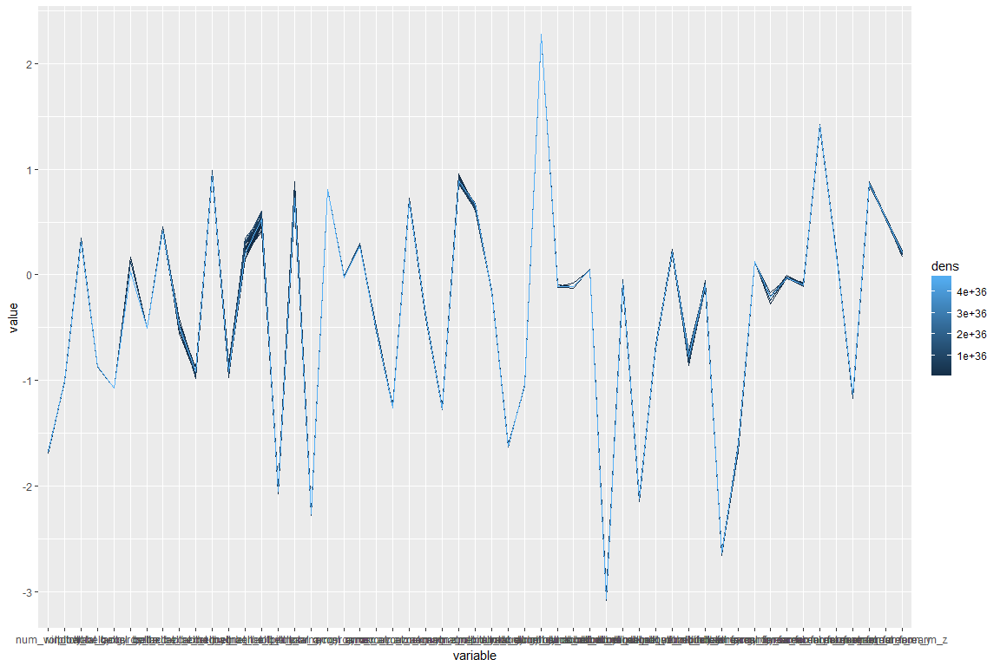

## Executive Summary

The report explore die relationship between some variables of data from acelerometers on the belt, forearm, and dumbell of 6 participants. The goal is to predict the "classe" variable. For the prediction of the 20 predefined test data sets the method Support Vector Machine is used and delivers good results.


## Data Preparation und Data Expoloration

#### Data Source

More Information about the accelerometer data is available from the website:
http://web.archive.org/web/20161224072740/http:/groupware.les.inf.puc-rio.br/har 

Training data: https://d396qusza40orc.cloudfront.net/predmachlearn/pml-training.csv

Test data: https://d396qusza40orc.cloudfront.net/predmachlearn/pml-testing.csv

The files should be made available in the current directory.


```
## [1] "size of pml-training.csv : 19622"
```

```
## [1] "size of pml-testing.csv  : 20"
```


#### Data Preparation

First, the columns with missing data are eliminated.


```r
## select columns without missing values
my_train <- dplyr::select( training, l_col_sel ) 
my_test  <- dplyr::select( testing,  l_col_sel )

## names of selected columns
paste("Explanary Variables:")
```

```
## [1] "Explanary Variables:"
```

```r
paste("--------------------")
```

```
## [1] "--------------------"
```

```r
names(my_train)
```

```
##  [1] "X"                    "user_name"            "raw_timestamp_part_1"
##  [4] "raw_timestamp_part_2" "cvtd_timestamp"       "new_window"          
##  [7] "num_window"           "roll_belt"            "pitch_belt"          
## [10] "yaw_belt"             "total_accel_belt"     "gyros_belt_x"        
## [13] "gyros_belt_y"         "gyros_belt_z"         "accel_belt_x"        
## [16] "accel_belt_y"         "accel_belt_z"         "magnet_belt_x"       
## [19] "magnet_belt_y"        "magnet_belt_z"        "roll_arm"            
## [22] "pitch_arm"            "yaw_arm"              "total_accel_arm"     
## [25] "gyros_arm_x"          "gyros_arm_y"          "gyros_arm_z"         
## [28] "accel_arm_x"          "accel_arm_y"          "accel_arm_z"         
## [31] "magnet_arm_x"         "magnet_arm_y"         "magnet_arm_z"        
## [34] "roll_dumbbell"        "pitch_dumbbell"       "yaw_dumbbell"        
## [37] "total_accel_dumbbell" "gyros_dumbbell_x"     "gyros_dumbbell_y"    
## [40] "gyros_dumbbell_z"     "accel_dumbbell_x"     "accel_dumbbell_y"    
## [43] "accel_dumbbell_z"     "magnet_dumbbell_x"    "magnet_dumbbell_y"   
## [46] "magnet_dumbbell_z"    "roll_forearm"         "pitch_forearm"       
## [49] "yaw_forearm"          "total_accel_forearm"  "gyros_forearm_x"     
## [52] "gyros_forearm_y"      "gyros_forearm_z"      "accel_forearm_x"     
## [55] "accel_forearm_y"      "accel_forearm_z"      "magnet_forearm_x"    
## [58] "magnet_forearm_y"     "magnet_forearm_z"     "classe"
```

The target variable "classe" is decomposed into 5 new numerical variables "classe_A", "classe_B", "classe_C", "classe_D" and "classe_E" for the prediction of the classification.


```r
## Target variables
my_train <- dplyr::mutate( my_train, classe_A = 0,
                                     classe_B = 0,
                                     classe_C = 0,
                                     classe_D = 0,
                                     classe_E = 0 )

my_train[ which( my_train$classe == "A") , ]$classe_A <- 1
my_train[ which( my_train$classe == "B") , ]$classe_B <- 1
my_train[ which( my_train$classe == "C") , ]$classe_C <- 1
my_train[ which( my_train$classe == "D") , ]$classe_D <- 1
my_train[ which( my_train$classe == "E") , ]$classe_E <- 1
```


#### Data Exploration

#### Parallel coordinates of explanary variables

By way of illustration, the explanatory variables are represented in a diagram of parallel coordinates.


```r
freqparcoord::freqparcoord( x=my_train[ , c( 7:59 )] ,m=30, k=20, faceting="classe" )
```

<!-- -->

#### Correlationen

Here is an overview of the correlations of the explanatory variables and the target variables:


```r
## correlations
cor_all <- abs( round( cor( x=my_train[,-c(1,2,5,6,60:65)], y=my_train[,c(61,62,63,64,65)] ), digits=4 ) )
```


#### Data for Training, Valuation and Test


```
## [1] "training data   : 14718 observations / 65 variables"
```

```
## [1] "validation data : 4904 observations / 65 variables"
```

```
## [1] "test data       : 20 observations / 60 variables"
```


## Modeling


#### cross validation

The training data is divided into 3 subsets.


```
## [1] "Size of 3-folder subsets:"
```

```
## 
##    1    2    3 
## 4905 4906 4907
```

#### Classification of variable "classe_A"

The classification of the target variables "classe" or "classe_A", "classe_B", "classe_C", "classe_D" and "classe_E" is made by using the method Support Vector Machine. That Each expression of the characteristic "classe" is classified by a separate column. The new columns are created as numeric values. The larger the value, the more likely the classification to the "classe" and the smaller the less likely.

The function "tune.svm" allows the implicit use of a cross validation.


```r
l_exp <- my_train[ , c( 7:59, 61 )]
tune.resA <- tune.svm( classe_A ~ . , data = l_exp,
                       tunecontrol = tune.control( cross=c_k ) )
svmfitA <- tune.resA$best.model
```


```r
VmodfitA <- predict( svmfitA, newdata=my_validation, se.fit = TRUE, interval = "confidence" )
## Normalization
pr_VmodFitA <- normal_data( my_modFit=VmodfitA )
```


```r
## paste("Validation: residuals for classe_A:")
sum_svmfit <- summary(svmfitA$residuals)
```


```r
## predict test data
TmodFitA <- predict( svmfitA, newdata=my_test, se.fit = TRUE, interval = "confidence" )
## Normalization
pr_TmodFitA <- normal_data( my_modFit=TmodFitA )
pr_TmodFitA 
```

```
##      1      2      3      4      5      6      7      8      9     10 
## 0.2014 0.8309 0.3572 0.9443 0.9901 0.0081 0.0000 0.0766 0.9946 0.9707 
##     11     12     13     14     15     16     17     18     19     20 
## 0.2023 0.1471 0.0603 1.0000 0.0329 0.0704 0.9609 0.1015 0.0418 0.0001
```


#### Classification of variable "classe_B"

Analogous to the classification of the variable "classe_A".


#### Classification of variable "classe_C"

Analogous to the classification of the variable "classe_A".


#### Classification of variable "classe_D"

Analogous to the classification of the variable "classe_A".


#### Classification of variable "classe_E"

Analogous to the classification of the variable "classe_A".


## Interpretation

#### Apply ml-algorithm to validation cases

Using the Confusion matrix, the quality of the classification is calculated on the validation data.


```r
table( as.factor( my_validation$classe ) )
```

```
## 
##    A    B    C    D    E 
## 1395  949  855  804  901
```


```r
paste("Validation: residuals:")
```

```
## [1] "Validation: residuals:"
```

```r
dimnames(sum_svmfit)[[1]] <- c( "classe_A", "classe_B", "classe_C", "classe_D", "classe_E" )
print( sum_svmfit )
```

```
##                Min.     1st Qu.        Median        Mean    3rd Qu.
## classe_A -0.8985468 -0.03670686 -0.0011469144 0.003946753 0.03516900
## classe_B -0.9002795 -0.03480234  0.0016192623 0.025870306 0.03488043
## classe_C -1.0410842 -0.03768213  0.0002230436 0.014326688 0.03783688
## classe_D -1.0315640 -0.02959478 -0.0013284890 0.021566969 0.02849192
## classe_E -0.3726540 -0.02640513 -0.0003377460 0.013980675 0.02499180
##               Max.
## classe_A 0.8956850
## classe_B 0.9755940
## classe_C 0.9321642
## classe_D 1.0234975
## classe_E 1.0365420
```


```r
caret::confusionMatrix( data=my_validation$classe, Vclasse )
```

```
## Confusion Matrix and Statistics
## 
##           Reference
## Prediction    A    B    C    D    E
##          A 1391    0    4    0    0
##          B   66  830   53    0    0
##          C    0   20  821   13    1
##          D    0    4   92  707    1
##          E    0    1   17   16  867
## 
## Overall Statistics
##                                           
##                Accuracy : 0.9413          
##                  95% CI : (0.9343, 0.9477)
##     No Information Rate : 0.2971          
##     P-Value [Acc > NIR] : < 2.2e-16       
##                                           
##                   Kappa : 0.9256          
##  Mcnemar's Test P-Value : NA              
## 
## Statistics by Class:
## 
##                      Class: A Class: B Class: C Class: D Class: E
## Sensitivity            0.9547   0.9708   0.8318   0.9606   0.9977
## Specificity            0.9988   0.9706   0.9913   0.9767   0.9916
## Pos Pred Value         0.9971   0.8746   0.9602   0.8794   0.9623
## Neg Pred Value         0.9812   0.9937   0.9590   0.9929   0.9995
## Prevalence             0.2971   0.1743   0.2013   0.1501   0.1772
## Detection Rate         0.2836   0.1692   0.1674   0.1442   0.1768
## Detection Prevalence   0.2845   0.1935   0.1743   0.1639   0.1837
## Balanced Accuracy      0.9768   0.9707   0.9116   0.9687   0.9946
```

The key figures Accuracy and Kappa as well as Sensitivity and Specificity are very high for the validation data, so that the classification can run on the test data.


#### Apply ML-algorithm to 20 test cases

The classification of the expression of the "classe" takes place, in which the largest value within a row is determined from the 5 values (majority vote). Based on the magnitude, the reader can immediately see how stable or uncertain the classification is. The larger a value stands out, the more stable the classification. The more equally distributed the values within a row, the more uncertain the assignment.


```r
l_view_Fit <- cbind( pr_TmodFitA, pr_TmodFitB, pr_TmodFitC, pr_TmodFitD, pr_TmodFitE )
l_view_Fit <- round( l_view_Fit, digits=3 )
```


```r
print( l_view_Fit, digits=3 )
```

```
##    classe A classe B classe C classe D classe E      classe with stability
## 1  "0.201"  "0.5"    "0.388"  "0"      "0.105"  "->" "B"    "0.42"        
## 2  "0.831"  "0.05"   "0.199"  "0.084"  "0"      "->" "A"    "0.71"        
## 3  "0.357"  "0.11"   "0.633"  "0.084"  "0.109"  "->" "C"    "0.49"        
## 4  "0.944"  "0.067"  "0.081"  "0.036"  "0.087"  "->" "A"    "0.78"        
## 5  "0.99"   "0.04"   "0.153"  "0.047"  "0.051"  "->" "A"    "0.77"        
## 6  "0.008"  "0"      "0.434"  "0.011"  "0.587"  "->" "E"    "0.56"        
## 7  "0"      "0.054"  "0.192"  "1"      "0.045"  "->" "D"    "0.77"        
## 8  "0.077"  "0.733"  "0.142"  "0.125"  "0.058"  "->" "B"    "0.65"        
## 9  "0.995"  "0.007"  "0.104"  "0.067"  "0.086"  "->" "A"    "0.79"        
## 10 "0.971"  "0.036"  "0.14"   "0.049"  "0.054"  "->" "A"    "0.78"        
## 11 "0.202"  "0.337"  "0.203"  "0.281"  "0.026"  "->" "B"    "0.32"        
## 12 "0.147"  "0.037"  "1"      "0.072"  "0.045"  "->" "C"    "0.77"        
## 13 "0.06"   "0.916"  "0.034"  "0.052"  "0.101"  "->" "B"    "0.79"        
## 14 "1"      "0.009"  "0.111"  "0.025"  "0.049"  "->" "A"    "0.84"        
## 15 "0.033"  "0.082"  "0.126"  "0.049"  "0.903"  "->" "E"    "0.76"        
## 16 "0.07"   "0.029"  "0"      "0.021"  "1"      "->" "E"    "0.89"        
## 17 "0.961"  "0.029"  "0.081"  "0.055"  "0.123"  "->" "A"    "0.77"        
## 18 "0.102"  "0.83"   "0.12"   "0.08"   "0.112"  "->" "B"    "0.67"        
## 19 "0.042"  "0.957"  "0.018"  "0.01"   "0.073"  "->" "B"    "0.87"        
## 20 "0"      "1"      "0.088"  "0.035"  "0.066"  "->" "B"    "0.84"
```

Notice:
The assignment of the test case 3) is faulty, but the stability is with the value 0.37 rather small.
